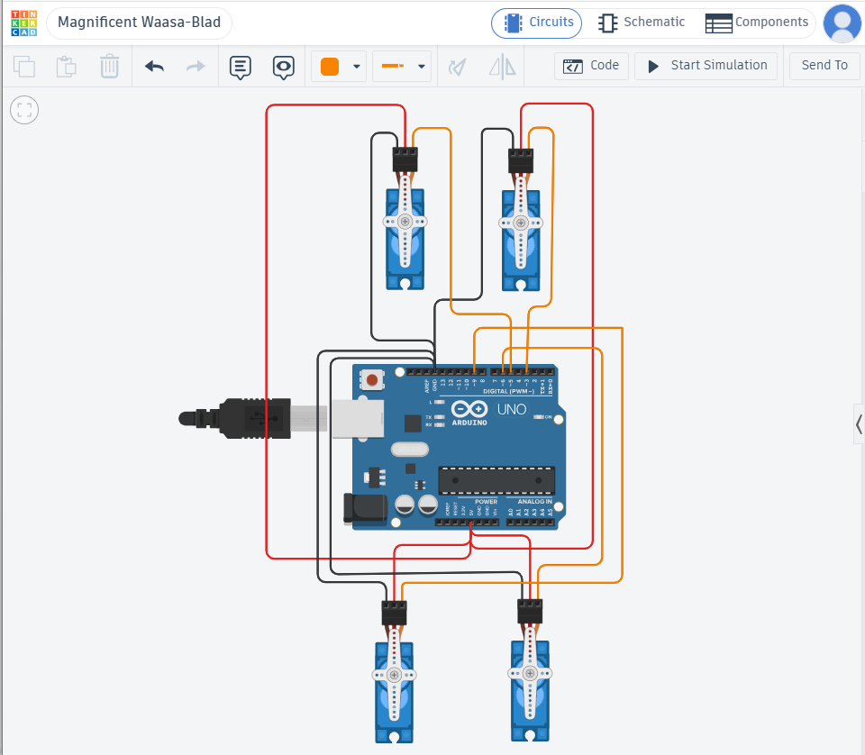

# 🤖 4-Servo Motor Control | Sweep & Hold Task

> **Smart Methods (الأساليب الذكية) — Summer Training Program**
> A simulation task built and tested on **Tinkercad Circuits**.


---

## 📋 Overview

This project programs **four servo motors** connected to an Arduino Uno to perform two sequential actions:

| Step | Action | Duration |
|------|--------|----------|
| 1️⃣ | Run the built-in **Sweep** motion (0° ↔ 180°) on all 4 servos simultaneously | 2 seconds |
| 2️⃣ | Stop and **hold all servos at 90°** | Indefinitely |

---

## 🎥 Demo Video

<video src="https://github.com/user-attachments/assets/PASTE-YOUR-VIDEO-LINK-HERE" controls width="600">
  Your browser does not support the video tag. Click below to watch the simulation.
</video>

> 🔗 **[Watch the full simulation video](PASTE-YOUR-VIDEO-LINK-HERE)**

---

## 🖼️ Circuit Diagram



*Arduino Uno R3 connected to 4 servo motors on digital PWM pins 3, 5, 6, and 9.*

---

## ⚙️ How It Works

1. **Setup Phase** — Each servo is attached to a dedicated PWM-capable digital pin.
2. **Sweep Phase (0–2s)** — A timer (`millis()`) tracks elapsed time while all four servos rotate from 0° → 180° → 0° repeatedly.
3. **Hold Phase (after 2s)** — Once the 2-second window ends, all servos are commanded to `90°` and remain fixed in that position.

---

## 🔌 Wiring / Pin Configuration

| Servo | Signal Pin | Power | Ground |
|:-----:|:----------:|:-----:|:------:|
| Servo 1 | Pin 3 | 5V | GND |
| Servo 2 | Pin 5 | 5V | GND |
| Servo 3 | Pin 6 | 5V | GND |
| Servo 4 | Pin 9 | 5V | GND |

---

## 💻 Arduino Code

```cpp
#include <Servo.h>

Servo servo1;
Servo servo2;
Servo servo3;
Servo servo4;

void setup() {
  servo1.attach(3);
  servo2.attach(5);
  servo3.attach(6);
  servo4.attach(9);

  // Step 1: Sweep motion for 2 seconds
  unsigned long startTime = millis();
  while (millis() - startTime < 2000) {
    for (int pos = 0; pos <= 180; pos += 1) {
      servo1.write(pos);
      servo2.write(pos);
      servo3.write(pos);
      servo4.write(pos);
      delay(5);
      if (millis() - startTime >= 2000) break;
    }
    for (int pos = 180; pos >= 0; pos -= 1) {
      servo1.write(pos);
      servo2.write(pos);
      servo3.write(pos);
      servo4.write(pos);
      delay(5);
      if (millis() - startTime >= 2000) break;
    }
  }

  // Step 2: Hold all servos at 90 degrees
  servo1.write(90);
  servo2.write(90);
  servo3.write(90);
  servo4.write(90);
}

void loop() {
  // Nothing here — servos remain fixed at 90° after setup
}
```

---

## 🧰 Tools & Technologies

- **Simulation Platform:** [Tinkercad Circuits](https://www.tinkercad.com/)
- **Microcontroller:** Arduino Uno R3
- **Language:** C++ (Arduino framework)
- **Components:** 4× Micro Servo Motors

---

## 📂 Repository Structure

```
├── servo_code.ino     # Arduino source code
├── circuit.png         # Circuit diagram screenshot
├── demo_video.mp4       # Simulation demo video
└── README.md            # Project documentation
```

---

## ✅ Task Requirements Checklist

- [x] 4 servo motors programmed
- [x] Sweep example running for exactly 2 seconds
- [x] All motors hold at 90° after the sweep
- [x] Simulated and verified on Tinkercad
- [x] Code and demo uploaded to GitHub

---

## 👩‍💻 Author

**Budur Saad**
Summer Training Program — Smart Methods (الأساليب الذكية)

---

<p align="center">Made with 💙 during the Smart Methods Summer Training Program</p>
